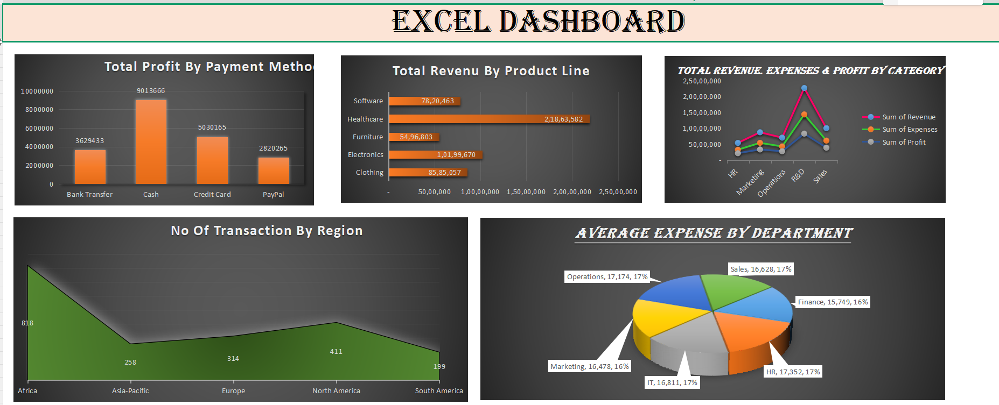

# 📊 Sales Performance Dashboard | Microsoft Excel

<p align="center">


</p>

---

# 📌 Project Overview

This project presents an interactive **Sales Performance Dashboard** built using **Microsoft Excel**. The dashboard transforms raw sales data into meaningful business insights, helping stakeholders monitor revenue, profitability, regional performance, payment trends, and departmental expenses.

It demonstrates how Excel can be used as a Business Intelligence tool for reporting and decision-making.

---

# 🎯 Business Objectives

✔ Analyze overall business performance

✔ Compare Revenue, Expenses & Profit

✔ Identify the highest-performing Product Lines

✔ Evaluate Payment Method profitability

✔ Analyze regional transaction distribution

✔ Compare department-wise expenses

---

# 🛠 Tools & Features Used

| Tool | Purpose |
|-------|----------|
| Microsoft Excel | Data Analysis |
| Pivot Tables | Data Summarization |
| Pivot Charts | Visualization |
| Slicers | Interactive Filtering |
| Conditional Formatting | KPI Highlighting |
| Dashboard Design | Business Reporting |

---

# 📈 Dashboard KPIs

- 💰 Total Revenue
- 💵 Total Profit
- 💸 Total Expenses
- 🛍 Revenue by Product Line
- 💳 Profit by Payment Method
- 🌍 Transactions by Region
- 🏢 Average Expense by Department

---

# 🖼 Dashboard Preview

> Upload a screenshot named **Dashboard.png** into this folder.

<p align="center">



</p>

---

# 📊 Dashboard Highlights

### 💰 Revenue by Product Line
Compare revenue generated across different product categories.

### 💳 Profit by Payment Method
Analyze which payment methods contribute the highest profit.

### 📈 Revenue vs Expenses vs Profit
Quickly evaluate financial performance.

### 🌍 Transactions by Region
Visualize customer activity across global regions.

### 🏢 Average Department Expenses
Compare spending across departments.

---

# 💡 Key Business Insights

- Clothing generated the highest revenue among all product lines.
- Credit Card and PayPal contributed significantly to overall profit.
- North America recorded the highest transaction volume.
- Departmental expenses remained relatively balanced.
- Interactive filters enable faster business reporting.

---

# 📂 Project Files

```
Sales-Data-Analysis/
│
├── README.md
├── Dashboard.png
├── Sales Data Analysis Excel.xlsx
└── Sales Data Analysis Excel.pdf
```

---

# 🚀 Skills Demonstrated

- Data Cleaning
- Data Analysis
- Dashboard Design
- Business Intelligence
- KPI Reporting
- Data Visualization
- Analytical Thinking
- Excel Reporting

---

# 📬 Connect with Me

**Eram Aiysha Shaikh**

📍 Mumbai, India

💼 Aspiring Data Analyst

### Tech Stack

- Microsoft Excel
- SQL
- Python
- Power BI
- Tableau
- Git & GitHub

---

⭐ If you found this project interesting, feel free to star the repository!
